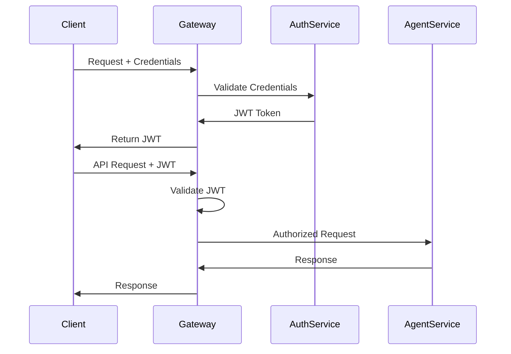

# System Architecture - Multi-Agent System

This document provides a comprehensive overview of the multi-agent system architecture, design patterns, and key components across all four implementation phases.

## 🏗️ Overall Architecture

### High-Level System Design

```
┌─────────────────────────────────────────────────────────────────────────────────────┐
│                              Multi-Agent System                                     │
├─────────────────────────────────────────────────────────────────────────────────────┤
│                                                                                     │
│  ┌─────────────────┐    ┌─────────────────┐    ┌─────────────────┐                │
│  │   Agent API     │    │  Plugin System  │    │  MCP Protocol   │                │
│  │   Gateway       │◄───┤   Manager       │◄───┤   Integration   │                │
│  │   (Phase 1)     │    │   (Phase 2)     │    │   (Phase 4)     │                │
│  └─────────────────┘    └─────────────────┘    └─────────────────┘                │
│           ▲                       ▲                       ▲                        │
│           │                       │                       │                        │
│  ┌─────────────────┐    ┌─────────────────┐    ┌─────────────────┐                │
│  │  Agent Service  │    │  Message Broker │    │  Tool Registry  │                │
│  │   & Business    │◄───┤  & Event Bus    │◄───┤  & Discovery    │                │
│  │     Logic       │    │   (Phase 3)     │    │   (Phase 4)     │                │
│  └─────────────────┘    └─────────────────┘    └─────────────────┘                │
│           ▲                       ▲                       ▲                        │
│           │                       │                       │                        │
│  ┌─────────────────┐    ┌─────────────────┐    ┌─────────────────┐                │
│  │   Data Layer    │    │  Security &     │    │  Monitoring &   │                │
│  │   H2/Redis/     │    │  Authentication │    │  Observability  │                │
│  │   PostgreSQL    │    │   (Phase 2)     │    │   (Phase 4)     │                │
│  └─────────────────┘    └─────────────────┘    └─────────────────┘                │
│                                                                                     │
└─────────────────────────────────────────────────────────────────────────────────────┘
```

## 📐 Design Principles

### Core Architectural Principles

1. **Progressive Complexity**: Each phase builds upon the previous, maintaining backward compatibility
2. **SOLID Principles**: Single responsibility, open/closed, Liskov substitution, interface segregation, dependency inversion
3. **Domain-Driven Design**: Clear separation between business logic and infrastructure
4. **Event-Driven Architecture**: Loose coupling through asynchronous messaging
5. **Microservices Ready**: Designed for eventual service decomposition

### Design Patterns Used

#### Structural Patterns
- **Strategy Pattern**: Pluggable NLP providers and agent behaviors
- **Factory Pattern**: Agent creation and plugin instantiation
- **Repository Pattern**: Data access abstraction
- **Facade Pattern**: Simplified API interfaces

#### Behavioral Patterns
- **Observer Pattern**: Event-driven notifications
- **Command Pattern**: Agent command processing
- **State Pattern**: Agent state management
- **Chain of Responsibility**: Request processing pipeline

#### Creational Patterns
- **Builder Pattern**: Complex agent configuration
- **Singleton Pattern**: System-wide configuration managers
- **Dependency Injection**: Spring-managed components

## 🔄 Phase-by-Phase Architecture Evolution

### Phase 1: Foundation Architecture

```
┌─────────────────────────────────────────────────────────────┐
│                    Phase 1: Foundation                     │
├─────────────────────────────────────────────────────────────┤
│                                                             │
│  ┌─────────────┐    ┌─────────────┐    ┌─────────────┐     │
│  │   REST API  │    │   Agent     │    │   Health    │     │
│  │ Controller  │◄───┤   Service   │◄───┤  Monitor    │     │
│  │             │    │             │    │             │     │
│  └─────────────┘    └─────────────┘    └─────────────┘     │
│         ▲                   ▲                              │
│         │                   │                              │
│  ┌─────────────┐    ┌─────────────┐                        │
│  │    Agent    │    │     H2      │                        │
│  │   Entity    │◄───┤  Database   │                        │
│  │    (JPA)    │    │             │                        │
│  └─────────────┘    └─────────────┘                        │
│                                                             │
└─────────────────────────────────────────────────────────────┘
```

**Key Components:**
- `AgentController`: REST endpoint management
- `AgentService`: Core business logic
- `Agent` entity: JPA-managed data model
- H2 database: Embedded persistence
- Basic error handling and logging

### Phase 2: Enhanced Capabilities

```
┌─────────────────────────────────────────────────────────────┐
│                Phase 2: Enhanced Capabilities              │
├─────────────────────────────────────────────────────────────┤
│                                                             │
│  ┌─────────────┐    ┌─────────────┐    ┌─────────────┐     │
│  │   JWT       │    │   Plugin    │    │    NLP      │     │
│  │ Security    │◄───┤  Manager    │◄───┤ Processing  │     │
│  │             │    │             │    │   (AI API)  │     │
│  └─────────────┘    └─────────────┘    └─────────────┘     │
│         ▲                   ▲                   ▲          │
│         │                   │                   │          │
│         │         ┌─────────────┐    ┌─────────────┐       │
│         │         │   Message   │    │    Task     │       │
│         └─────────┤   Broker    │◄───┤   Queue     │       │
│                   │             │    │   (Redis)   │       │
│                   └─────────────┘    └─────────────┘       │
│                                                             │
└─────────────────────────────────────────────────────────────┘
```

**New Components:**
- `SecurityConfig`: JWT authentication
- `PluginManager`: Dynamic capability loading
- `NLPProcessor`: AI API integration
- `MessageBroker`: Inter-agent communication
- `TaskQueue`: Asynchronous processing

### Phase 3: Multi-Agent Orchestration

```
┌─────────────────────────────────────────────────────────────┐
│             Phase 3: Multi-Agent Orchestration             │
├─────────────────────────────────────────────────────────────┤
│                                                             │
│  ┌─────────────┐    ┌─────────────┐    ┌─────────────┐     │
│  │   Agent     │    │  Workflow   │    │    Event    │     │
│  │  Registry   │◄───┤Orchestrator │◄───┤     Bus     │     │
│  │             │    │             │    │             │     │
│  └─────────────┘    └─────────────┘    └─────────────┘     │
│         ▲                   ▲                   ▲          │
│         │                   │                   │          │
│  ┌─────────────┐    ┌─────────────┐    ┌─────────────┐     │
│  │   Service   │    │    Load     │    │   Agent     │     │
│  │  Discovery  │◄───┤  Balancer   │◄───┤Specialization│     │
│  │             │    │             │    │             │     │
│  └─────────────┘    └─────────────┘    └─────────────┘     │
│                                                             │
└─────────────────────────────────────────────────────────────┘
```

**New Components:**
- `AgentRegistry`: Service discovery
- `WorkflowOrchestrator`: Complex task coordination
- `EventBus`: Decoupled communication
- `LoadBalancer`: Request distribution
- `AgentSpecialization`: Role-based capabilities

### Phase 4: MCP Integration & Production

```
┌─────────────────────────────────────────────────────────────┐
│          Phase 4: MCP Integration & Production             │
├─────────────────────────────────────────────────────────────┤
│                                                             │
│  ┌─────────────┐    ┌─────────────┐    ┌─────────────┐     │
│  │    MCP      │    │    Tool     │    │  Resource   │     │
│  │   Client    │◄───┤  Discovery  │◄───┤  Manager    │     │
│  │             │    │             │    │             │     │
│  └─────────────┘    └─────────────┘    └─────────────┘     │
│         ▲                   ▲                   ▲          │
│         │                   │                   │          │
│  ┌─────────────┐    ┌─────────────┐    ┌─────────────┐     │
│  │    MCP      │    │   Metrics   │    │ Kubernetes  │     │
│  │   Server    │◄───┤ Collector   │◄───┤ Deployment  │     │
│  │             │    │             │    │             │     │
│  └─────────────┘    └─────────────┘    └─────────────┘     │
│                                                             │
└─────────────────────────────────────────────────────────────┘
```

**New Components:**
- `MCPClient`: Protocol communication
- `MCPServer`: Capability exposure
- `ToolRegistry`: Dynamic tool discovery
- `ResourceManager`: Access control
- `MetricsCollector`: Observability
- Kubernetes manifests

## 🗄️ Data Architecture

### Database Design

#### Entity Relationship Diagram

```
┌─────────────────┐         ┌─────────────────┐         ┌─────────────────┐
│      Agent      │         │    Command      │         │   Execution     │
├─────────────────┤         ├─────────────────┤         ├─────────────────┤
│ id (PK)         │◄──────┐ │ id (PK)         │◄──────┐ │ id (PK)         │
│ name            │       │ │ agent_id (FK)   │       │ │ command_id (FK) │
│ type            │       │ │ content         │       │ │ status          │
│ status          │       │ │ timestamp       │       │ │ result          │
│ configuration   │       │ │ context         │       │ │ started_at      │
│ created_at      │       │ │ nlp_provider    │       │ │ completed_at    │
│ updated_at      │       │ └─────────────────┘       │ │ error_message   │
└─────────────────┘       │                           │ └─────────────────┘
         │                │                           │
         │                │                           │
         │         ┌─────────────────┐                │
         │         │     Plugin      │                │
         │         ├─────────────────┤                │
         └────────►│ id (PK)         │                │
                   │ agent_id (FK)   │                │
                   │ name            │                │
                   │ version         │                │
                   │ configuration   │                │
                   │ enabled         │                │
                   └─────────────────┘                │
                                                      │
         ┌─────────────────┐                         │
         │     Event       │                         │
         ├─────────────────┤                         │
         │ id (PK)         │                         │
         │ execution_id(FK)│◄────────────────────────┘
         │ type            │
         │ payload         │
         │ timestamp       │
         │ processed       │
         └─────────────────┘
```

#### Database Schema Evolution

**Phase 1 Schema:**
```sql
-- Core agent table
CREATE TABLE agents (
    id BIGINT PRIMARY KEY AUTO_INCREMENT,
    name VARCHAR(255) NOT NULL,
    type VARCHAR(100) NOT NULL,
    status VARCHAR(50) NOT NULL,
    configuration TEXT,
    created_at TIMESTAMP DEFAULT CURRENT_TIMESTAMP,
    updated_at TIMESTAMP DEFAULT CURRENT_TIMESTAMP ON UPDATE CURRENT_TIMESTAMP
);

-- Command history
CREATE TABLE commands (
    id BIGINT PRIMARY KEY AUTO_INCREMENT,
    agent_id BIGINT REFERENCES agents(id),
    content TEXT NOT NULL,
    timestamp TIMESTAMP DEFAULT CURRENT_TIMESTAMP,
    context TEXT
);
```

**Phase 2 Schema Additions:**
```sql
-- Plugin management
CREATE TABLE plugins (
    id BIGINT PRIMARY KEY AUTO_INCREMENT,
    agent_id BIGINT REFERENCES agents(id),
    name VARCHAR(255) NOT NULL,
    version VARCHAR(50),
    configuration TEXT,
    enabled BOOLEAN DEFAULT true
);

-- Authentication
CREATE TABLE users (
    id BIGINT PRIMARY KEY AUTO_INCREMENT,
    username VARCHAR(255) UNIQUE NOT NULL,
    password_hash VARCHAR(255) NOT NULL,
    roles VARCHAR(500),
    created_at TIMESTAMP DEFAULT CURRENT_TIMESTAMP
);
```

**Phase 3 Schema Additions:**
```sql
-- Agent registry
CREATE TABLE agent_instances (
    id BIGINT PRIMARY KEY AUTO_INCREMENT,
    agent_id BIGINT REFERENCES agents(id),
    instance_id VARCHAR(255) UNIQUE NOT NULL,
    host VARCHAR(255) NOT NULL,
    port INTEGER NOT NULL,
    status VARCHAR(50) NOT NULL,
    last_heartbeat TIMESTAMP,
    capabilities TEXT
);

-- Workflow management
CREATE TABLE workflows (
    id BIGINT PRIMARY KEY AUTO_INCREMENT,
    name VARCHAR(255) NOT NULL,
    definition TEXT NOT NULL,
    status VARCHAR(50) NOT NULL,
    created_at TIMESTAMP DEFAULT CURRENT_TIMESTAMP
);
```

**Phase 4 Schema Additions:**
```sql
-- MCP tools and resources
CREATE TABLE mcp_tools (
    id BIGINT PRIMARY KEY AUTO_INCREMENT,
    name VARCHAR(255) NOT NULL,
    description TEXT,
    schema TEXT NOT NULL,
    agent_id BIGINT REFERENCES agents(id),
    enabled BOOLEAN DEFAULT true
);

CREATE TABLE mcp_resources (
    id BIGINT PRIMARY KEY AUTO_INCREMENT,
    uri VARCHAR(500) NOT NULL,
    name VARCHAR(255),
    mime_type VARCHAR(100),
    agent_id BIGINT REFERENCES agents(id),
    access_level VARCHAR(50) DEFAULT 'read'
);
```

## 🔌 API Architecture

### RESTful API Design

#### Core API Structure

```
/api/v1/
├── agents/                     # Agent management
│   ├── GET /                   # List all agents
│   ├── POST /                  # Create new agent
│   ├── GET /{id}              # Get agent details
│   ├── PUT /{id}              # Update agent
│   ├── DELETE /{id}           # Delete agent
│   └── POST /{id}/execute     # Execute command
├── commands/                   # Command history
│   ├── GET /                   # List commands
│   ├── GET /{id}              # Get command details
│   └── GET /agent/{agentId}   # Commands by agent
├── plugins/                    # Plugin management (Phase 2+)
│   ├── GET /                   # List plugins
│   ├── POST /                  # Install plugin
│   └── PUT /{id}/toggle       # Enable/disable plugin
├── workflows/                  # Workflow management (Phase 3+)
│   ├── GET /                   # List workflows
│   ├── POST /                  # Create workflow
│   ├── POST /{id}/execute     # Execute workflow
│   └── GET /{id}/status       # Workflow status
└── mcp/                       # MCP endpoints (Phase 4+)
    ├── GET /tools             # Available tools
    ├── POST /tools/{name}     # Execute tool
    ├── GET /resources         # Available resources
    └── GET /resources/{uri}   # Get resource content
```

#### API Standards

**Request/Response Format:**
```json
// Standard Response Envelope
{
  "success": true,
  "data": {...},
  "error": null,
  "timestamp": "2024-01-01T00:00:00Z",
  "version": "1.0.0"
}

// Error Response
{
  "success": false,
  "data": null,
  "error": {
    "code": "AGENT_NOT_FOUND",
    "message": "Agent with ID 123 not found",
    "details": {...}
  },
  "timestamp": "2024-01-01T00:00:00Z",
  "version": "1.0.0"
}
```

**HTTP Status Codes:**
- `200` - Success
- `201` - Created
- `400` - Bad Request
- `401` - Unauthorized
- `403` - Forbidden
- `404` - Not Found
- `409` - Conflict
- `500` - Internal Server Error

## ⚡ Performance Architecture

### Caching Strategy

```
┌─────────────────────────────────────────────────────────────┐
│                    Caching Layers                          │
├─────────────────────────────────────────────────────────────┤
│                                                             │
│  ┌─────────────┐    ┌─────────────┐    ┌─────────────┐     │
│  │   Browser   │    │   CDN/      │    │    API      │     │
│  │    Cache    │◄───┤   Proxy     │◄───┤   Gateway   │     │
│  │   (Static)  │    │   Cache     │    │   Cache     │     │
│  └─────────────┘    └─────────────┘    └─────────────┘     │
│                              ▲                   ▲          │
│                              │                   │          │
│                    ┌─────────────┐    ┌─────────────┐       │
│                    │   Redis     │    │    JVM      │       │
│                    │   Cache     │◄───┤   Cache     │       │
│                    │ (Session/   │    │ (Objects/   │       │
│                    │  Temp Data) │    │  Metadata)  │       │
│                    └─────────────┘    └─────────────┘       │
│                                                             │
└─────────────────────────────────────────────────────────────┘
```

### Scaling Strategies

#### Horizontal Scaling
```yaml
# Kubernetes Horizontal Pod Autoscaler
apiVersion: autoscaling/v2
kind: HorizontalPodAutoscaler
metadata:
  name: agent-system-hpa
spec:
  scaleTargetRef:
    apiVersion: apps/v1
    kind: Deployment
    name: agent-system
  minReplicas: 2
  maxReplicas: 10
  metrics:
  - type: Resource
    resource:
      name: cpu
      target:
        type: Utilization
        averageUtilization: 70
  - type: Resource
    resource:
      name: memory
      target:
        type: Utilization
        averageUtilization: 80
```

#### Load Balancing
- **Application Load Balancer**: Route requests based on path
- **Round Robin**: Distribute requests evenly
- **Sticky Sessions**: Maintain user session affinity
- **Health Checks**: Remove unhealthy instances

## 🔒 Security Architecture

### Security Layers

```
┌─────────────────────────────────────────────────────────────┐
│                   Security Architecture                    │
├─────────────────────────────────────────────────────────────┤
│                                                             │
│  ┌─────────────┐    ┌─────────────┐    ┌─────────────┐     │
│  │    TLS/     │    │     JWT     │    │    RBAC     │     │
│  │    HTTPS    │◄───┤    Token    │◄───┤    &        │     │
│  │             │    │ Validation  │    │    ACL      │     │
│  └─────────────┘    └─────────────┘    └─────────────┘     │
│         ▲                   ▲                   ▲          │
│         │                   │                   │          │
│  ┌─────────────┐    ┌─────────────┐    ┌─────────────┐     │
│  │   Input     │    │   Rate      │    │  Audit      │     │
│  │ Validation  │◄───┤ Limiting    │◄───┤ Logging     │     │
│  │ & Sanitiz.  │    │ & Throttle  │    │             │     │
│  └─────────────┘    └─────────────┘    └─────────────┘     │
│                                                             │
└─────────────────────────────────────────────────────────────┘
```

### Authentication Flow



## 📊 Monitoring & Observability

### Observability Stack

```
┌─────────────────────────────────────────────────────────────┐
│                Observability Architecture                  │
├─────────────────────────────────────────────────────────────┤
│                                                             │
│  ┌─────────────┐    ┌─────────────┐    ┌─────────────┐     │
│  │   Metrics   │    │   Logging   │    │   Tracing   │     │
│  │(Prometheus) │◄───┤ (ELK Stack) │◄───┤ (Jaeger)    │     │
│  │             │    │             │    │             │     │
│  └─────────────┘    └─────────────┘    └─────────────┘     │
│         ▲                   ▲                   ▲          │
│         │                   │                   │          │
│  ┌─────────────┐    ┌─────────────┐    ┌─────────────┐     │
│  │   Grafana   │    │  Alerting   │    │   Health    │     │
│  │ Dashboard   │◄───┤ (AlertMgr)  │◄───┤   Checks    │     │
│  │             │    │             │    │             │     │
│  └─────────────┘    └─────────────┘    └─────────────┘     │
│                                                             │
└─────────────────────────────────────────────────────────────┘
```

### Key Metrics

- **Application Metrics**: Request rates, response times, error rates
- **Business Metrics**: Agent executions, command success rates, plugin usage
- **Infrastructure Metrics**: CPU, memory, disk usage, network traffic
- **Custom Metrics**: Agent performance, NLP response times, queue depths

## 🚀 Deployment Architecture

### Container Architecture

```dockerfile
# Multi-stage build example
FROM maven:3.8-openjdk-17 AS build
WORKDIR /app
COPY pom.xml .
RUN mvn dependency:go-offline
COPY src ./src
RUN mvn package -DskipTests

FROM openjdk:17-jre-slim
RUN addgroup --system spring && adduser --system spring --ingroup spring
USER spring:spring
WORKDIR /app
COPY --from=build /app/target/*.jar app.jar
EXPOSE 8080
ENTRYPOINT ["java", "-jar", "app.jar"]
```

### Kubernetes Deployment

```yaml
apiVersion: apps/v1
kind: Deployment
metadata:
  name: agent-system
spec:
  replicas: 3
  selector:
    matchLabels:
      app: agent-system
  template:
    metadata:
      labels:
        app: agent-system
    spec:
      containers:
      - name: agent-system
        image: agent-system:latest
        ports:
        - containerPort: 8080
        env:
        - name: SPRING_PROFILES_ACTIVE
          value: "prod"
        resources:
          requests:
            memory: "512Mi"
            cpu: "250m"
          limits:
            memory: "1Gi"
            cpu: "500m"
        livenessProbe:
          httpGet:
            path: /actuator/health
            port: 8080
          initialDelaySeconds: 30
          periodSeconds: 10
        readinessProbe:
          httpGet:
            path: /actuator/health/readiness
            port: 8080
          initialDelaySeconds: 5
          periodSeconds: 5
```

## 🔄 Integration Patterns

### MCP Integration Architecture

```
┌─────────────────────────────────────────────────────────────┐
│              MCP Integration Architecture                   │
├─────────────────────────────────────────────────────────────┤
│                                                             │
│  ┌─────────────┐    ┌─────────────┐    ┌─────────────┐     │
│  │    MCP      │    │   Server    │    │   Client    │     │
│  │  Protocol   │◄───┤   Adapter   │◄───┤   Adapter   │     │
│  │             │    │             │    │             │     │
│  └─────────────┘    └─────────────┘    └─────────────┘     │
│         ▲                   ▲                   ▲          │
│         │                   │                   │          │
│  ┌─────────────┐    ┌─────────────┐    ┌─────────────┐     │
│  │    Tool     │    │  Resource   │    │ Transport   │     │
│  │ Discovery   │◄───┤  Manager    │◄───┤   Layer     │     │
│  │             │    │             │    │(WebSocket/  │     │
│  └─────────────┘    └─────────────┘    │   HTTP)     │     │
│                                        └─────────────┘     │
└─────────────────────────────────────────────────────────────┘
```

---

This architecture document provides the foundation for understanding how all components work together. Each phase builds upon this architecture, adding complexity and capabilities while maintaining the core design principles.

For implementation details, refer to the phase-specific documentation:
- [Phase 1 Architecture](docs/phase1/architecture.md)
- [Phase 2 Architecture](docs/phase2/README.md)
- [Phase 3 Architecture](docs/phase3/README.md)
- [Phase 4 Architecture](docs/phase4/README.md)