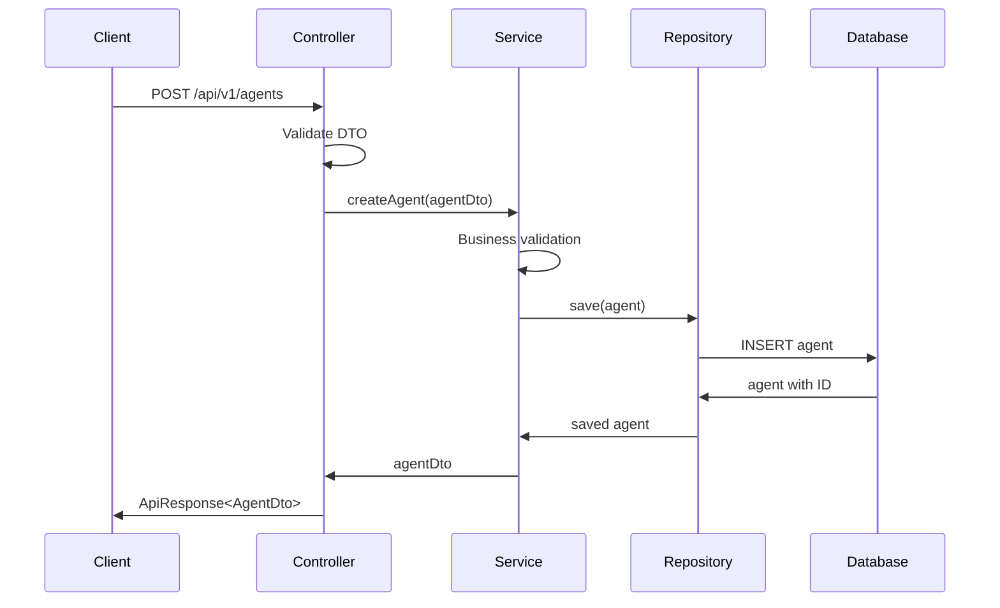
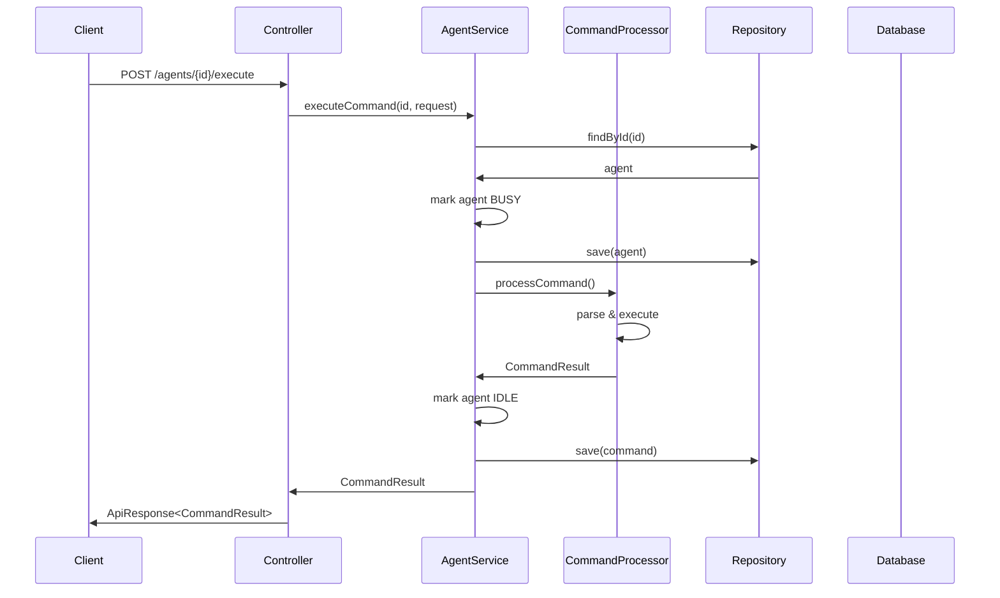
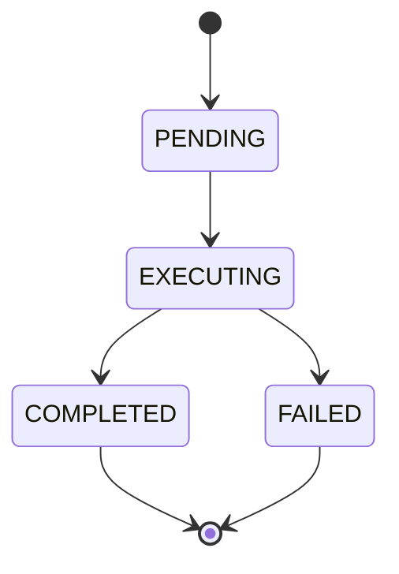

# Phase 1 Architecture - Foundation Design

This document details the technical architecture of Phase 1, providing in-depth information about the design decisions, patterns, and implementation details of the foundation agent system.

## 🏗️ System Overview

Phase 1 implements a foundational multi-agent system with the following core principles:

- **Simplicity First**: Clean, understandable design that serves as a solid foundation
- **SOLID Principles**: Single responsibility, open/closed, dependency inversion
- **Domain-Driven Design**: Clear separation between business logic and infrastructure
- **Test-Friendly**: Designed for easy testing and mocking
- **Extensible**: Built to support future phases without breaking changes

## 📐 Architectural Layers

### 1. Presentation Layer

```
┌─────────────────────────────────────────────────────────────┐
│                    Presentation Layer                       │
├─────────────────────────────────────────────────────────────┤
│                                                             │
│  ┌─────────────┐    ┌─────────────┐    ┌─────────────┐     │
│  │    REST     │    │    API      │    │   Global    │     │
│  │ Controller  │◄───┤  Response   │◄───┤ Exception   │     │
│  │             │    │  Wrapper    │    │  Handler    │     │
│  └─────────────┘    └─────────────┘    └─────────────┘     │
│                                                             │
└─────────────────────────────────────────────────────────────┘
```

**Components:**
- `AgentController`: REST endpoints for agent operations
- `ApiResponse<T>`: Standardized response wrapper
- `GlobalExceptionHandler`: Centralized error handling

**Key Design Decisions:**
- RESTful API design with standard HTTP methods
- Consistent response format across all endpoints
- Comprehensive error handling with meaningful error codes
- CORS enabled for development (to be restricted in production)

### 2. Service Layer

```
┌─────────────────────────────────────────────────────────────┐
│                     Service Layer                          │
├─────────────────────────────────────────────────────────────┤
│                                                             │
│  ┌─────────────┐    ┌─────────────┐    ┌─────────────┐     │
│  │   Agent     │    │   Command   │    │    DTO      │     │
│  │  Service    │◄───┤ Processor   │◄───┤ Mapping     │     │
│  │             │    │             │    │             │     │
│  └─────────────┘    └─────────────┘    └─────────────┘     │
│                                                             │
└─────────────────────────────────────────────────────────────┘
```

**Components:**
- `AgentService`: Core business logic for agent management
- `CommandProcessor`: Natural language command processing
- DTOs: Data transfer objects for API boundaries

**Key Design Decisions:**
- Service layer encapsulates all business logic
- Command processing is separated for future AI integration
- DTO pattern prevents tight coupling between API and domain models
- Transactional boundaries properly defined

### 3. Domain Layer

```
┌─────────────────────────────────────────────────────────────┐
│                     Domain Layer                           │
├─────────────────────────────────────────────────────────────┤
│                                                             │
│  ┌─────────────┐    ┌─────────────┐    ┌─────────────┐     │
│  │    Agent    │    │   Command   │    │   Enums     │     │
│  │   Entity    │◄───┤   Entity    │◄───┤ & Value     │     │
│  │             │    │             │    │  Objects    │     │
│  └─────────────┘    └─────────────┘    └─────────────┘     │
│                                                             │
└─────────────────────────────────────────────────────────────┘
```

**Components:**
- `Agent`: Core domain entity representing an autonomous agent
- `Command`: Domain entity for command execution history
- Enums: `AgentType`, `AgentStatus`, `CommandStatus`

**Key Design Decisions:**
- Rich domain models with business methods
- JPA entity listeners for audit fields
- Bidirectional relationships properly managed
- Enums provide type safety and extensibility

### 4. Data Access Layer

```
┌─────────────────────────────────────────────────────────────┐
│                   Data Access Layer                        │
├─────────────────────────────────────────────────────────────┤
│                                                             │
│  ┌─────────────┐    ┌─────────────┐    ┌─────────────┐     │
│  │   Agent     │    │   Command   │    │     H2      │     │
│  │ Repository  │◄───┤ Repository  │◄───┤  Database   │     │
│  │             │    │             │    │             │     │
│  └─────────────┘    └─────────────┘    └─────────────┘     │
│                                                             │
└─────────────────────────────────────────────────────────────┘
```

**Components:**
- `AgentRepository`: Custom queries for agent operations
- `CommandRepository`: Command history and analytics queries
- H2 Database: Embedded database for development

**Key Design Decisions:**
- Repository pattern abstracts data access
- Custom queries for complex operations
- Database indexes for performance
- Embedded H2 for easy development and testing

## 🔄 Data Flow Architecture

### 1. Agent Creation Flow



### 2. Command Execution Flow



## 💾 Database Schema Design

### Entity Relationship Diagram

```
┌─────────────────┐         ┌─────────────────┐
│      Agent      │         │    Command      │
├─────────────────┤         ├─────────────────┤
│ id (PK)         │◄──────┐ │ id (PK)         │
│ name (UNIQUE)   │       │ │ agent_id (FK)   │
│ type            │       │ │ content         │
│ status          │       │ │ context         │
│ configuration   │       │ │ result          │
│ description     │       │ │ status          │
│ created_at      │       │ │ nlp_provider    │
│ updated_at      │       │ │ execution_time  │
└─────────────────┘       │ │ error_message   │
                          │ │ timestamp       │
                          │ └─────────────────┘
                          │
                          └─ One-to-Many
```

### Table Specifications

#### Agents Table
```sql
CREATE TABLE agents (
    id BIGINT PRIMARY KEY AUTO_INCREMENT,
    name VARCHAR(255) NOT NULL UNIQUE,
    type VARCHAR(100) NOT NULL,
    status VARCHAR(50) NOT NULL,
    configuration TEXT,
    description VARCHAR(1000),
    created_at TIMESTAMP NOT NULL DEFAULT CURRENT_TIMESTAMP,
    updated_at TIMESTAMP NOT NULL DEFAULT CURRENT_TIMESTAMP ON UPDATE CURRENT_TIMESTAMP
);

-- Indexes for performance
CREATE INDEX idx_agent_name ON agents(name);
CREATE INDEX idx_agent_type_status ON agents(type, status);
```

#### Commands Table
```sql
CREATE TABLE commands (
    id BIGINT PRIMARY KEY AUTO_INCREMENT,
    agent_id BIGINT NOT NULL,
    content TEXT NOT NULL,
    context TEXT,
    result TEXT,
    status VARCHAR(50) NOT NULL,
    nlp_provider VARCHAR(100),
    execution_time_ms BIGINT,
    error_message TEXT,
    timestamp TIMESTAMP NOT NULL DEFAULT CURRENT_TIMESTAMP,
    
    FOREIGN KEY (agent_id) REFERENCES agents(id)
);

-- Indexes for performance
CREATE INDEX idx_command_agent_id ON commands(agent_id);
CREATE INDEX idx_command_timestamp ON commands(timestamp);
CREATE INDEX idx_command_status ON commands(status);
```

## 🔧 Command Processing Architecture

### Natural Language Processing Pipeline

```
┌─────────────────────────────────────────────────────────────┐
│                Command Processing Pipeline                  │
├─────────────────────────────────────────────────────────────┤
│                                                             │
│  ┌─────────────┐    ┌─────────────┐    ┌─────────────┐     │
│  │   Input     │    │   Intent    │    │  Command    │     │
│  │ Validation  │───►│   Detection │───►│ Execution   │     │
│  │             │    │             │    │             │     │
│  └─────────────┘    └─────────────┘    └─────────────┘     │
│                                                             │
└─────────────────────────────────────────────────────────────┘
```

**Phase 1 Implementation:**
- **Pattern Matching**: Regular expressions for intent detection
- **Command Handlers**: Specific handlers for each intent type
- **Response Generation**: Template-based responses

**Intent Categories:**
- `greeting`: Hello, hi, hey
- `help`: Help, assist, support
- `status`: Status, health, state
- `info`: Information, details
- `analyze`: Analyze, review, check
- `create`: Create, generate, build
- `explain`: Explain, describe, tell
- `system`: Shutdown, restart, reset

### Command Execution States



## ⚡ Performance Considerations

### Database Performance

**Indexing Strategy:**
- Primary keys for O(1) lookups
- Foreign key indexes for joins
- Composite indexes for common query patterns
- Covering indexes for read-heavy operations

**Query Optimization:**
- Lazy loading for relationships
- Pagination for large result sets
- Custom queries for complex operations
- Projection queries for specific data needs

### Memory Management

**Entity Management:**
- JPA entity lifecycle properly managed
- Transactional boundaries minimize memory usage
- DTOs prevent entity leakage to presentation layer
- Connection pooling for database efficiency

### Concurrency Handling

**Thread Safety:**
- Service layer methods are stateless
- Repository operations are thread-safe
- Agent status changes are atomic
- Command processing is isolated per request

## 🔒 Security Architecture

### Input Validation

```
┌─────────────────────────────────────────────────────────────┐
│                   Security Layers                          │
├─────────────────────────────────────────────────────────────┤
│                                                             │
│  ┌─────────────┐    ┌─────────────┐    ┌─────────────┐     │
│  │   Input     │    │ Business    │    │    Data     │     │
│  │ Validation  │───►│ Validation  │───►│ Validation  │     │
│  │ (@Valid)    │    │ (Service)   │    │ (JPA)       │     │
│  └─────────────┘    └─────────────┘    └─────────────┘     │
│                                                             │
└─────────────────────────────────────────────────────────────┘
```

**Validation Layers:**
1. **DTO Validation**: Bean Validation annotations
2. **Business Validation**: Service layer checks
3. **Database Constraints**: JPA constraints and validations

### Error Handling Strategy

**Exception Hierarchy:**
- `AgentNotFoundException`: Agent not found
- `CommandExecutionException`: Command processing failures
- `IllegalArgumentException`: Invalid inputs
- `IllegalStateException`: Invalid operations

**Error Response Format:**
```json
{
  "success": false,
  "error": {
    "code": "AGENT_NOT_FOUND",
    "message": "Agent with ID 123 not found",
    "details": {...}
  },
  "timestamp": "2024-01-01T00:00:00Z",
  "version": "1.0.0"
}
```

## 📊 Monitoring and Observability

### Health Checks

**Built-in Health Indicators:**
- Database connectivity
- Disk space availability
- Application status

**Custom Health Indicators:**
- Agent system status
- Command processing health
- Repository availability

### Metrics Collection

**Application Metrics:**
- Request counts and response times
- Agent creation/deletion rates
- Command execution statistics
- Error rates by endpoint

**Business Metrics:**
- Active agent count
- Command success/failure rates
- Average command execution time
- Most popular command types

## 🚀 Deployment Architecture

### Application Properties

**Development Configuration:**
```yaml
server:
  port: 8080

spring:
  datasource:
    url: jdbc:h2:mem:agentdb
    driver-class-name: org.h2.Driver
  h2:
    console:
      enabled: true
  jpa:
    show-sql: true
    hibernate:
      ddl-auto: create-drop

logging:
  level:
    com.jamesokeeffe.agentsystem: DEBUG
```

**Production Configuration:**
```yaml
server:
  port: 8080

spring:
  datasource:
    url: ${DATABASE_URL}
    username: ${DATABASE_USERNAME}
    password: ${DATABASE_PASSWORD}
  jpa:
    show-sql: false
    hibernate:
      ddl-auto: validate

logging:
  level:
    root: INFO
    com.jamesokeeffe.agentsystem: INFO
```

### Build and Packaging

**Maven Build:**
```bash
# Development build
./mvnw clean package

# Production build
./mvnw clean package -Pprod

# With tests
./mvnw clean package -Pintegration
```

**Docker Support:**
```dockerfile
FROM openjdk:17-jre-slim
WORKDIR /app
COPY target/*.jar app.jar
EXPOSE 8080
ENTRYPOINT ["java", "-jar", "app.jar"]
```

## 🔄 Extension Points for Future Phases

### Phase 2 Preparation

**Plugin System Hooks:**
- `CommandProcessor` can be extended with AI providers
- Service layer supports additional agent types
- Repository layer ready for additional entities

**Security Integration Points:**
- Controller layer ready for authentication interceptors
- Service layer supports user context
- Database schema extensible for user management

**Messaging Preparation:**
- Service layer designed for event publishing
- Entity changes can trigger events
- Command processing supports async operations

### Phase 3 Readiness

**Multi-Agent Support:**
- Agent entity supports configuration for roles
- Command processing supports delegation
- Repository queries support discovery patterns

**Workflow Integration:**
- Command processing supports complex workflows
- Service layer can coordinate multiple agents
- Database supports workflow state management

### Phase 4 Compatibility

**MCP Protocol Support:**
- Service layer abstracts protocol details
- Command processing supports tool discovery
- Repository layer supports resource management

**Production Features:**
- Configuration externalized
- Monitoring endpoints available
- Health checks comprehensive

## 📚 Design Patterns Used

### Creational Patterns
- **Factory Method**: Entity creation in services
- **Builder**: Complex DTO construction

### Structural Patterns
- **Repository**: Data access abstraction
- **Facade**: Service layer API simplification
- **DTO**: Data transfer between layers

### Behavioral Patterns
- **Strategy**: Command processing strategies
- **Observer**: JPA entity listeners
- **Template Method**: Response wrapper construction

---

This architecture provides a solid foundation that can evolve through all four phases while maintaining backward compatibility and clean separation of concerns.